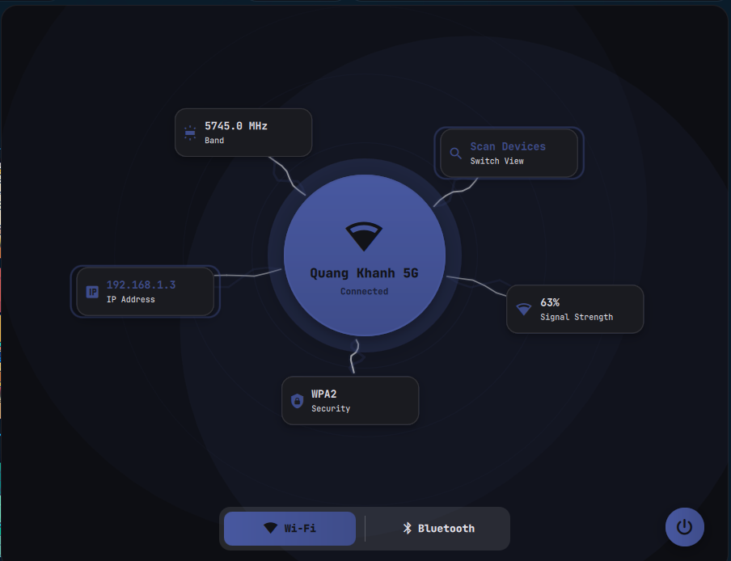
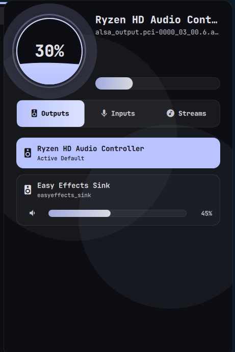
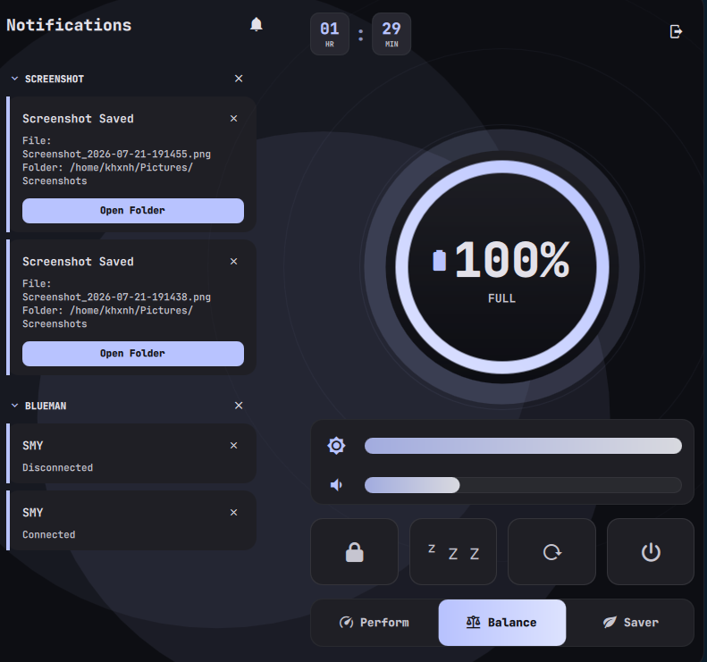
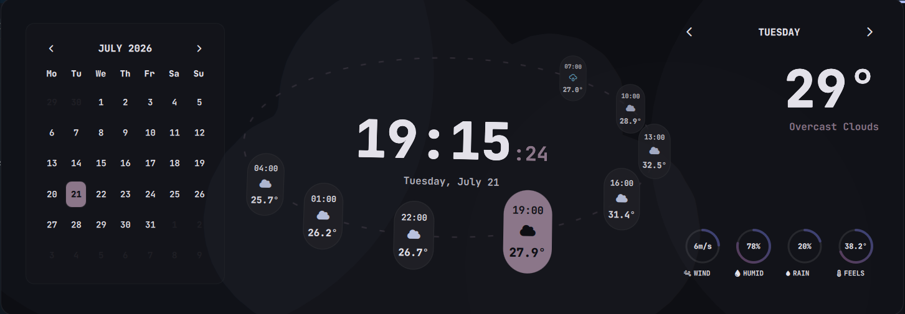
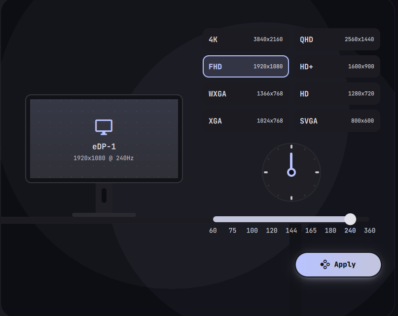
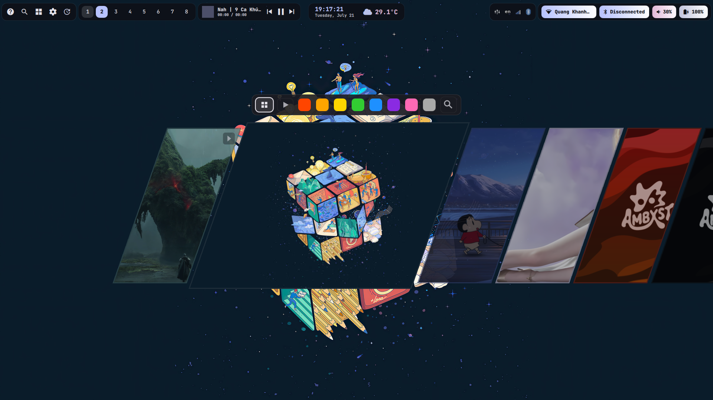
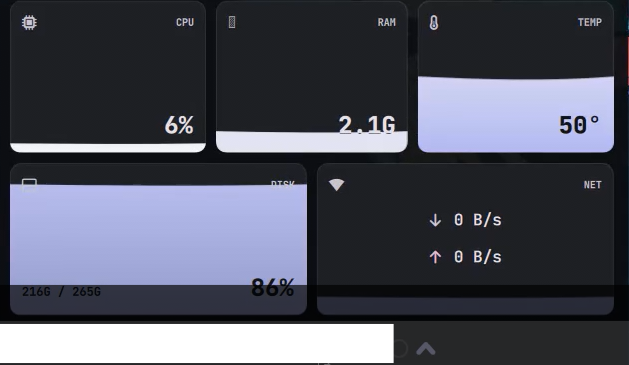
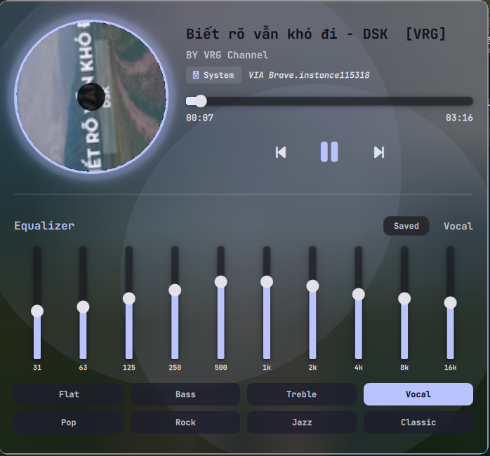
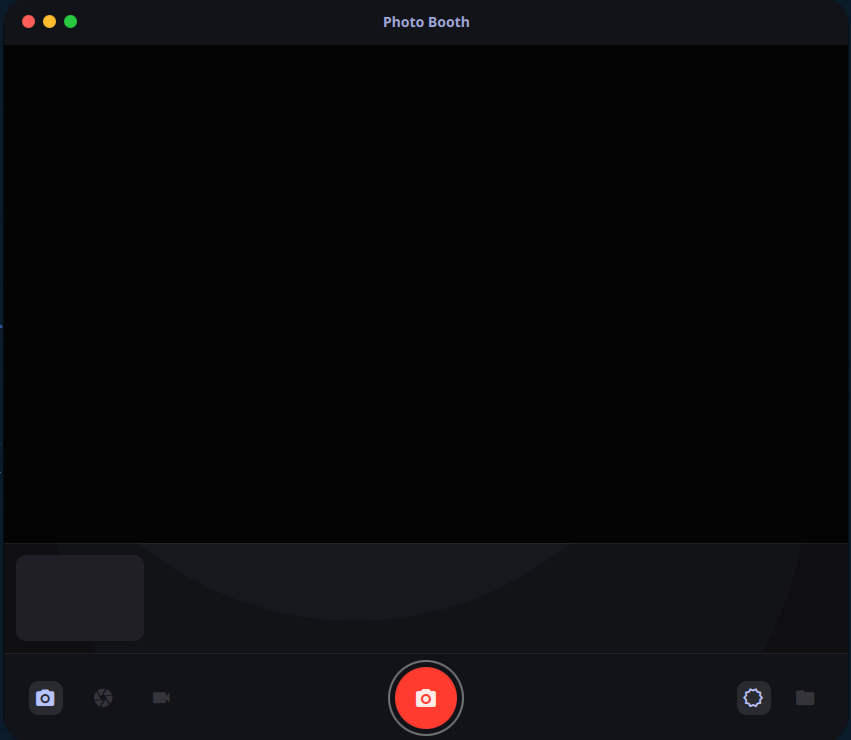

# Lucretia: Niri & Quickshell

A state-of-the-art, high-performance, and visually stunning Wayland desktop environment built on **Niri** and **Quickshell** (QML/Qt6). 

Featuring real-time Material You dynamic color theme generation, customized high-speed utility widgets, and custom C++ backend controllers.

> **Forked from** [ilyamiro/nixos-configuration](https://github.com/ilyamiro/nixos-configuration) — adapted for **Niri**.

---

## 🚀 Fast Automated Installation

You can automatically deploy this entire desktop configuration, resolve dependencies, and compile all C++ background daemons on **Arch Linux** with a single command:

```bash
curl -sL https://raw.githubusercontent.com/noqokhxnh/lucretia/main/install.sh | bash
```

> [!NOTE]
> The interactive installer will check for existing configurations, create safe backups under `~/.config-backup-[timestamp]`, set up required fonts, configure keyboard layouts, set up graphics drivers, and allow you to configure display managers (SDDM) and weather APIs.

---

##  Preview

| | | |
|---|---|---|
|  |  |  |
|  |  |  |
|  |  |  |


